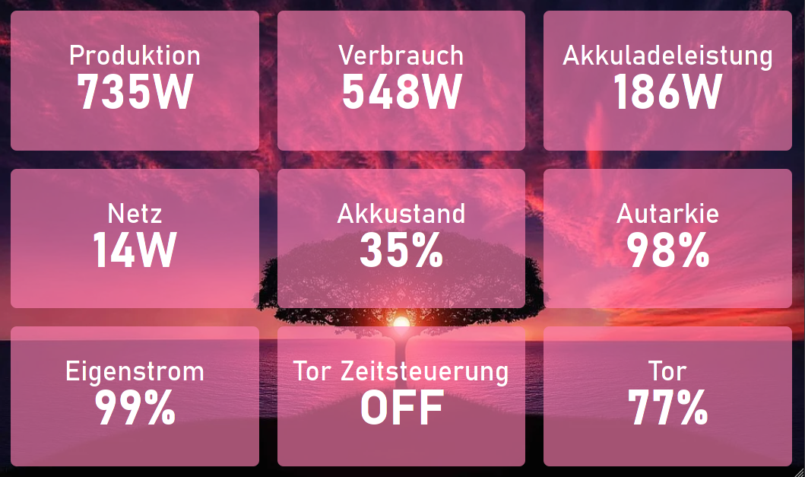

# smartdashboard
A custom dashboard for openHAB.


## Usage
### pre-generated
 - download the latest release
 - unpack it to your webroot
 - put your config in `configs` folder. You can use the existing files as examples. (you can also have it somewhere else if CORS is allowed)
 - go to `http:<host>:<port>/config` and set the values
 - enjoy your dashboard

### Self generated

 - clone this repo
 - run `yarn`
 - put your config in static/configs folder. (you can also have it somewhere else if CORS is allowed)
 - run `yarn generate`
 - deploy `dist` folder to your webserver.
 - go to `http:<host>:<port>/config` and set the values
 - enjoy your dashboard

## Features
### Supported Item types
All items are supported for display. The listed items have a special implementation for either read or write.
 - Dimmer
 - Number
 - Switch
 - Color

## Build Setup

```bash
# install dependencies
$ yarn install

# serve with hot reload at localhost:3000
$ yarn dev

# build for production and launch server
$ yarn build
$ yarn start

# generate static project
$ yarn generate
```

For detailed explanation on how things work, check out [Nuxt.js docs](https://nuxtjs.org).
